# Conditioning the photorealistic preview (R4)

**Question:** how do we get an image model to render *this* plan, rather than a
generic backyard — and what does that cost us in dependencies?

Feeds [R4 — photorealistic AI preview](../stories/R4-photorealistic-preview.md).

## Setup

| | |
|---|---|
| Backend | SwarmUI 0.9.8.1, `localhost:7801` (ComfyUI engine) |
| Model | `z_image_turbo_bf16.safetensors` (Z-Image Turbo, BF16) |
| Hardware | Apple Silicon, 36 GB unified memory |
| Date | 2026-07-26 |

Two things had to be sorted before any of this ran. The FP8 build of Z-Image
(`SwarmUI_Z-Image-Turbo-FP8Mix`) fails on Apple Silicon with
`Undefined type Float8_e4m3fn` — MPS has no FP8 — so it was replaced with the
BF16 build. And SwarmUI sets no CORS header by default, which blocks a
browser-direct call from the app origin; `AccessControlAllowOrigin` in
`Data/Settings.fds` fixes it.

A note for anyone reading the API: `ListT2IParams` reports **zero values for
every model-type parameter**, including the base `model` dropdown. That is not a
missing model — model lists come from `ListModels`. I misdiagnosed a working
ControlNet install this way.

## 1. Does the scene prompt alone produce anything useful?

`scene_prompt()` turns a `Plan` into one sentence. Fed to the model with no image
input:

```
"A photorealistic backyard landscape, roughly 40 by 30 feet, bordered by a house,
 a multi-level wood deck, a paver area in a herringbone pattern in the front-right,
 a hot tub in the front-left, a fire pit in the middle, Photorealistic, natural
 daylight, professionally landscaped, wide-angle view"

768×768 · steps 8 · cfg 1.0 · seed 12345 · 1m41s (including the 11 GB model load)
```

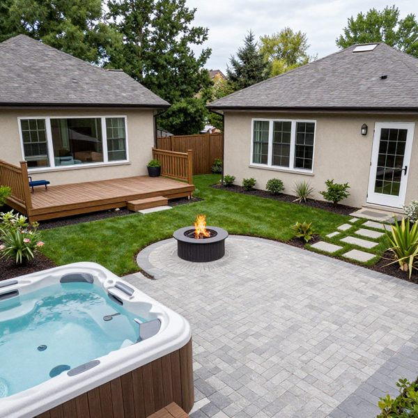

It honored the *positions*: hot tub front-left, fire pit centered, deck and patio
where the sentence put them. Good enough that "eye-level mode" is worth shipping
on the prompt alone.

## 2. Can an image steer the output? (botched)

Fed image 1 back as `initimage` with `usereferenceonly: true`, and deliberately
changed the prompt to "large open lawn and a wooden pergola" so any carryover
would be obvious.

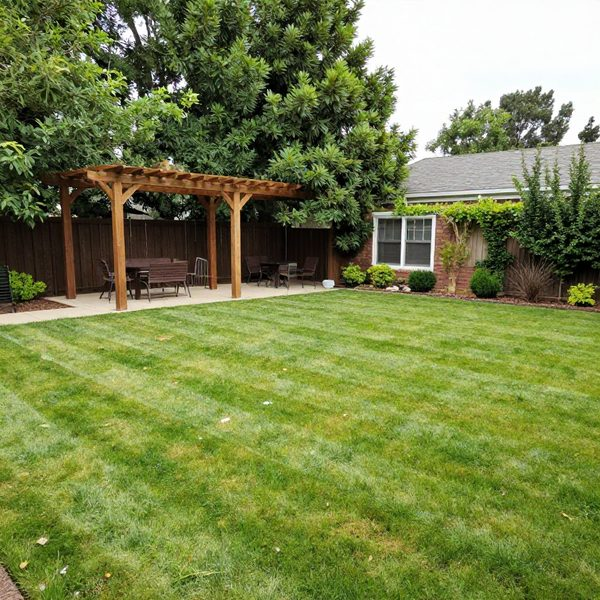

Nothing carried over. But the run was invalid: I set `initimagecreativity: 1.0`,
and the parameter means *fraction of denoising steps to actually run* — 1.0 runs
all of them, discarding the input. The test could not have shown transfer.

Recorded because the failure mode is easy to repeat: a "creativity" dial that
silently means "ignore the thing I gave you" at its top end.

## 3. Same test, correct parameter

`initimagecreativity: 0.55`, everything else identical.

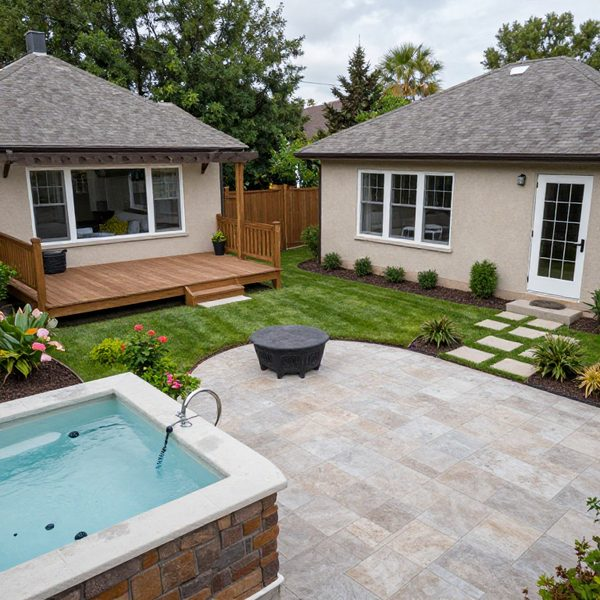

The house, roofs, deck, hot tub, fire pit, patio and stepping stones all
survived; the pergola never appeared. The image overrides the prompt, and it
*improves* what it keeps — the patio came back as travertine, the tub gained a
stone surround.

**Consequence:** img2img conditions on a *whole scene*, not a component. "Here is
a photo of my house, put that house in a new layout" is not reachable this way —
composition comes along for the ride. That splits site photos into two features:
restyling a real yard photo (works today) versus describing a house's style
(better done by running the photo through the existing Claude vision bridge and
folding the description into the prompt).

## 4. Can the 2D plan be the input image?

If img2img follows an input this strongly, maybe the faithful overhead view needs
no ControlNet at all.

SLP's plan colors are already close to the real colors of what they represent —
mulch `#6b4a2f`, pavers `#9a9ca0`, deck `#c8a97e`, hot tub `#6faec5`. A
rasterized plan is effectively a color-blocked aerial painting, which is the kind
of input diffusion models photorealize well.

Except the lawn. The app draws it `#eef0e6`, near-white. So two synthetic plans
were built with PIL using SLP's real fills, differing only in the lawn:

| Input A — app colors | Input B — preview colors |
|---|---|
| 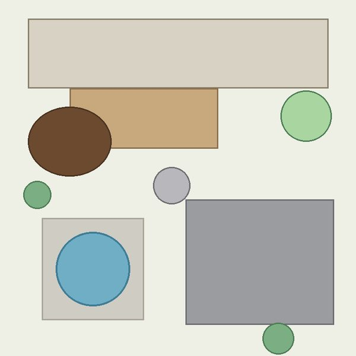 | 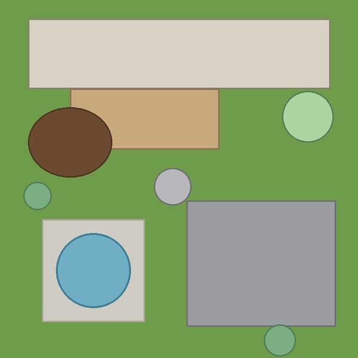 |

Prompt and seed fixed across the sweep; only `initimagecreativity` varied:

```
"Aerial drone photograph of a residential backyard, photorealistic, green lawn,
 stone paver patio, wood deck, mulch bed, hot tub, fire pit, natural daylight,
 top-down view, high detail"                         768×768 · seed 4242
```

| 0.4 · 8 steps · 36s | 0.55 · 8 steps · 18s | 0.7 · 8 steps · 28s |
|---|---|---|
| 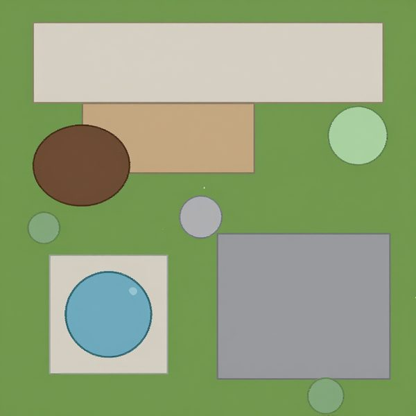 | 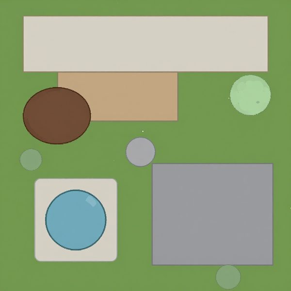 | 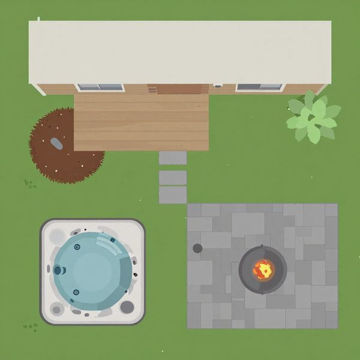 |
| unchanged — flat diagram | barely moved | real planking, cut stone, a tub with jets, a lit fire pit — but illustrated |

### Does the near-white lawn matter?

Input A at the same 0.55:

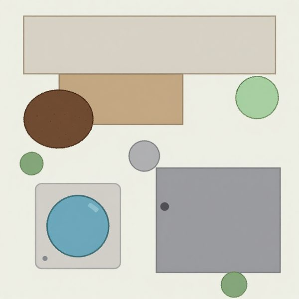

No grass appeared; it stayed a pale diagram. The model needs a color signal
saying "lawn." **The preview cannot be a screenshot of the canvas.**

### Pushing to photorealism

0.7 gave a good illustration, not a photograph. Two levers: more creativity, or
more steps.

| 0.8 · 8 steps · 35s | 0.7 · 20 steps · 57s | 0.85 · 20 steps · 69s |
|---|---|---|
| 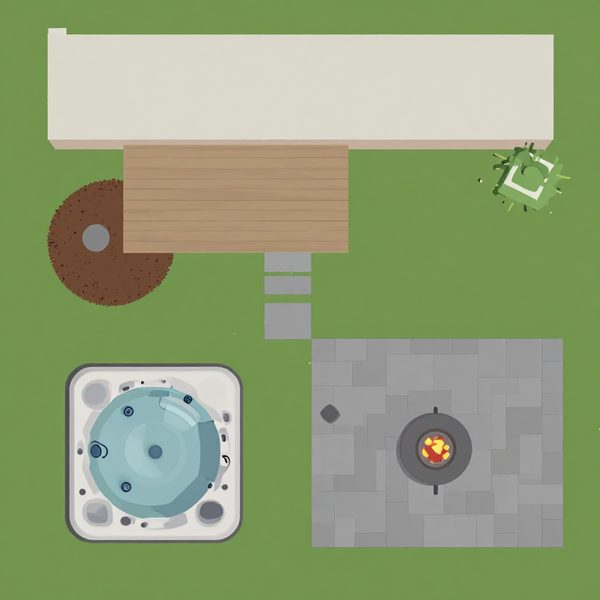 | 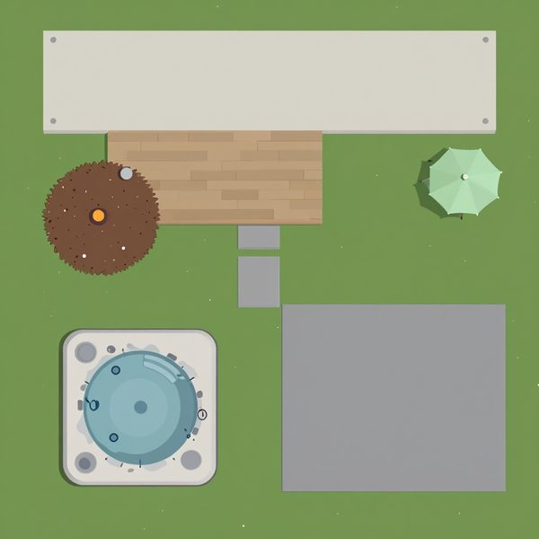 | 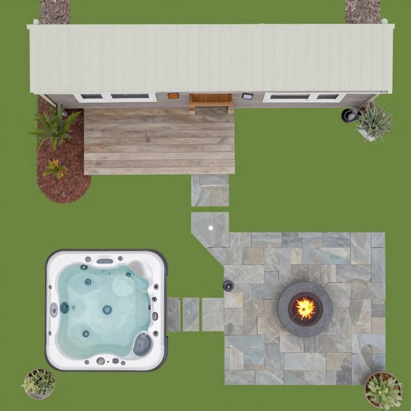 |
| still illustrated | *more* stylized — the tree became a patio umbrella | photoreal: weathered planking, irregular flagstone, acrylic tub shell, real flame |

Creativity is the lever, not steps. The input is flat vector art, and you need
enough noise to destroy that flatness before the model renders texture. Steps add
detail once past that threshold but can't substitute for it — 0.7 at 20 steps was
*more* cartoonish than 0.7 at 8. The knee sits between 0.8 and 0.85.

### Where geometry held

At 0.85, everything stayed where it was drawn — house on the north edge, deck
below it, mulch back-left, hot tub and pad front-left, patio front-right. The
fire pit drifted from the centre of the lawn into the patio. The lawn itself
stayed flat green, because the input gave it no texture to build on.

## Decisions

| Decision | Because |
|---|---|
| **Drop ControlNet from R4.** | img2img alone reproduced the layout faithfully. Removes a 1.8 GB model plus union-type and preprocessor configuration. |
| **R4.2 renders a preview-specific raster, not a screenshot.** | Near-white lawn never becomes grass; material-true colors are required. It's a flag on the renderer, not new machinery. |
| **Defaults: creativity 0.85, steps 20.** | The only combination in the sweep that produced a photograph. |
| **Expose creativity as a user control.** | It is precisely the "how closely should this follow my plan" dial — 0.7 for a clean illustration, 0.85 for a photo. |
| **Overhead and eye-level both run on the same local model.** | No hosted API needed for either; eye-level is the same call without an init image. |

## Still open

- Do SLP's tiled material photos (already supported for drawn areas) beat flat
  fills as an init image? Likely yes, and free.
- Would texture in the raster's lawn produce real turf instead of flat green?
- Does adding ControlNet *on top of* img2img fix the fire-pit drift? SwarmUI
  accepts both in one request.
- `usereferenceonly` was never validly tested — run 2 was confounded and it
  wasn't retried.
- IP-Adapter is unavailable here (`useipadapter` offers only `None`), and those
  are architecture-specific; a Z-Image-compatible one may not exist yet.
